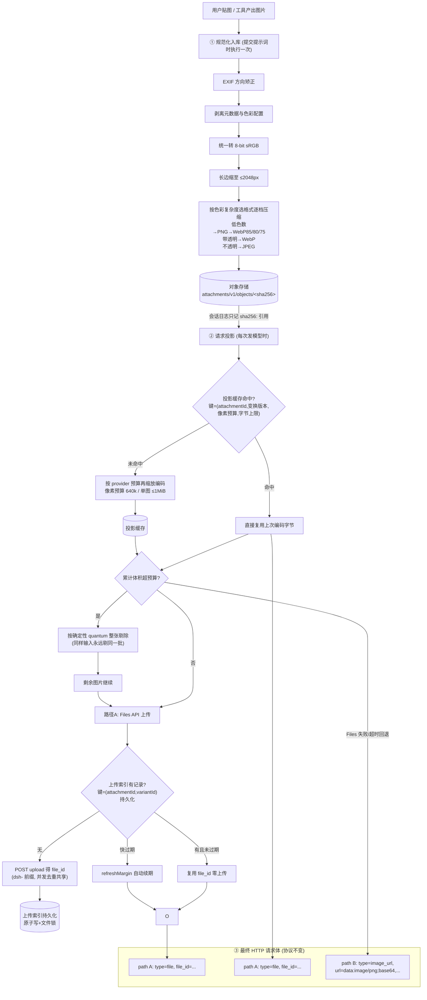

# 你的图片是怎么"喂"给大模型的？—— 拆解 DeepSeek Harness 的图像管线（v0.1.1）

> 📌 本篇是「dsh 构建细节与大模型知识」系列第 1 篇 · 后续将逐步拆解 agent loop / compaction / KV-cache 等主题
>
> 适用版本 deepseek-harness `0.1.1-rc.2` · 面向读者：会用大模型 API，但不清楚底层机制的开发者 · 阅读时间 ≈ 10 分钟

## TL;DR — 先记住三句话

1. 图片最终发给模型时，仍然是协议规定的两种形态之一：`base64 data URL` 或 DeepSeek 特有的 `file_id` 引用。
2. harness 在这层之下做了三件事：**规范化存储 → 带缓存的请求投影 → Files 上传复用**，让同一张图在本地、网络、KV-cache 三层都只付一次成本。
3. 所有预算（张数、字节、像素）都是**确定性闸门**：同样输入永远剔除同样的图，保证会话重放一字节不差。

## 一、先补课：模型眼中的图片是什么？

很多同学的第一印象是"AI 能看图"，但传输层面其实很朴素。以 OpenAI 兼容协议为例，一张图片在 HTTP 请求体里就是一段 JSON：

```json
{
  "role": "user",
  "content": [
    { "type": "text", "text": "这张图里有什么？" },
    {
      "type": "image_url",
      "image_url": { "url": "data:image/png;base64,iVBORw0KGgoAAA..." }
    }
  ]
}
```

关键点：图片不是"文件"，而是被编码成 `base64` 字符串后**内联**进请求 JSON。这意味着：

- 一张 5MB 的截图，base64 后膨胀约 33% 变成 ~6.7MB 文本；多轮对话里每轮都要重发一遍。
- 服务端解码后按像素转成视觉 token，消耗的是上下文窗口和真金白银的 token 费用。

> ⚠️ **痛点由此而来**：多图、长会话场景下，如果不加管理，请求体会迅速膨胀到几十 MB，既容易超 provider 的 body 大小限制，也让每次重试/重放的代价翻倍。这就是 dsh v0.1.1 图像管线要解决的问题。

## 二、全景流程图：从你贴图到模型看到图



## 三、三个阶段逐个拆解

### 阶段① 规范化入库 —— "一次付费，终身使用"

图片进入会话时只处理一次，产物落在内容寻址的对象存储里：

```
<DSH_HOME>/attachments/v1/objects/<sha256前2位>/<完整sha256>
```

为什么用 sha256 做 id？因为内容相同 = 地址相同。**同一张图被贴三次，磁盘上只有一份**；校验也免费——读出来算一下 hash 就知道有没有损坏。

规范化规则（摘自 `packages/attachment-local/README.md`）：

| 项目 | 默认值 |
|---|---|
| 每消息图片数上限 | 20 张 |
| 单源字节上限 | 20 MiB |
| 像素上限 | 64,000,000 px（单边 ≤8192px） |
| 长边缩放 | ≤2048px（等比） |
| 归一化产物上限 | 4 MiB |

> 💡 **为什么日志只存引用？** 会话日志（JSONL）需要长期保存和重放。如果把几 MB 的 base64 直接写进日志，一个多图会话能把日志撑到几百 MB。存 `sha256:` 引用后，日志只有几十字节，重启/fork 会话时再从对象库按引用重建。

### 阶段② 请求投影 —— 缓存如何省钱又稳定

"投影"这个词听起来抽象，其实就是回答一个问题：**这张图这次发给模型时，应该长什么样？**

不同 provider 对输入图的限制不同（像素预算、编码字节数），所以同一张归一化图可能需要不同"版本"。dsh 的做法是把整个变换做成**纯函数**并缓存结果：

```
缓存键 = (attachmentId, transformVersion, pixelBudget, byteCap, 编码器固定参数)
缓存值 = 最终编码字节
```

两个直接收益：

- **省 CPU**：同图同预算不重复压缩；并发同 key 只做一次变换大家共享。
- **稳 KV-cache**：这是最容易被忽略的重磅收益。provider 的 prompt cache 按"前缀字节完全一致"命中。如果每次请求对同一张图的压缩结果有随机抖动（比如压缩器并行度导致字节差异），前缀就会失效，整段上下文重新计费。字节级确定的投影保证了"同图 = 同字节 = cache 必命中"。

### 阶段③ 双路径传输 —— file_id 不是给模型的索引

这里纠正一个常见误解：`file_id` **不是让模型自己去检索文件的指针**，模型根本不知道"文件系统"的存在。它是给 **DeepSeek 服务端**的取图凭证：

```jsonc
// 路径 A：先传文件服务，请求里只带短 id（推荐，大图首选）
{ "type": "file", "file_id": "file-abc123..." }

// 路径 B：传统内联（Files 不可用时的自动回退）
{ "type": "image_url", "image_url": { "url": "data:image/jpeg;base64,/9j/4AAQ..." } }
```

两条路径由适配层自动选择与降级：`filesApiTimeoutMs` 内上传失败 → 无感切回 base64。对上层调用方完全透明。

**也不是分批传入。**预算（≤600 张/请求、Files 引用累计 128MiB、内联累计 20MiB）是准入闸门而非切片器：超限时按确定性 quantum 规则**整张剔除**并在日志可见，绝不把一张图切成两半发。

## 四、上传复用：同图跨会话零上传

Files 路径还有一层持久化优化——上传索引：

```ts
// packages/llm/llm-deepseek/src/upload-index.ts
interface DeepSeekUploadRecord {
  scope: string              // 由 apiKey 派生的非敏感命名空间（不落盘密钥本身）
  attachmentId: AttachmentId // 哪张图（sha256）
  variantId: ImageVariantId  // 投影参数指纹（含路由预算）
  fileId: DeepSeekFileId     // 服务端返回的 file_id
  expiresAt: number          // 过期时间，refreshMargin 提前续传
}
```

效果：**昨天传过的架构图，今天新开会话再引用，直接命中索引拿 file_id，零上传、零等待。**索引用原子写+文件锁保护，多进程并发安全；同图并发上传也会合并为一次（SharedUpload waiters 计数）。

## 五、这套设计对普通开发者的启示

即使你不用 dsh，这三条经验也直接可迁移到你自己的 AI 应用：

1. **内容寻址 + 引用化**：大二进制永远不要塞进会话历史/数据库正文，用 hash 寻址的对象库 + 轻量引用。省空间、天然去重、可校验完整性。
2. **把变换写成纯函数并按参数指纹缓存**：任何"输入→输出"型计算（图片压缩、文本摘要 embedding）都可以这样套。特别是走 LLM 的链路，**字节级确定性的预处理是保住 prompt cache 的前提**。
3. **大资源走引用、小开销走内联，且必须有自动降级**：Files 这类"先上传后引用"的模式能砍掉 95%+ 的请求体，但一定要有 base64 兜底，否则第三方接口抖动就全线故障。

## 六、对照检查：你的应用踩坑了吗？

| 常见反模式 | 后果 | dsh 的解法 |
|---|---|---|
| base64 直接存进聊天记录表 | DB 行超大、查询变慢、备份爆炸 | 对象库 + sha256 引用，日志仅几十字节 |
| 每轮把全部历史图重新编码发送 | 延迟高、token 翻倍计费 | 投影缓存命中即复用字节；Files 复用免重传 |
| 压缩算法含时间戳/随机参数 | prompt cache 全量 miss，费用×N | 纯函数 + 版本化 transformVersion |
| 超限直接报错打断用户 | 体验差 | 确定性剔除 + 日志可见，会话可继续 |

## 七、下一篇预告

本系列的下一篇计划拆解 **Compaction（上下文压实）**：当对话超过 128k token 时，系统如何在"保留关键决策"与"释放窗口"之间权衡，以及它为什么选择"重放原 system prompt 来复用 KV-cache"这个精巧实现。关注仓库 `docs/` 目录获取更新。

---

参考源码（deepseek-harness 0.1.1-rc.2）：packages/attachment/attachment-local · packages/llm/llm-deepseek/src/{serialize,file-store,upload-index}.ts · HTML 交互版见 [01-llm-image-pipeline.html](01-llm-image-pipeline.html)
