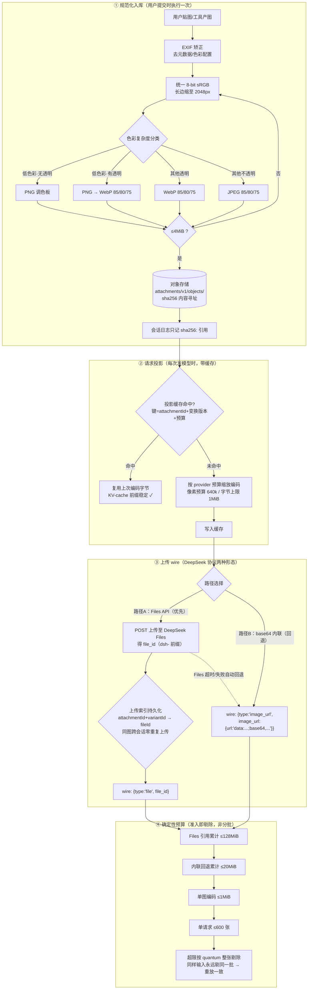

# dsh 图像管线详解 — 图片是如何进入大模型的

> 面向 AI 应用开发者的底层原理讲解 · 基于 deepseek-harness 0.1.1-rc.2 · 对比 opencode / cc-switch 方案

[English](#english) | [中文正文如下](#一为什么需要图像管线)

---

## 一、为什么需要"图像管线"？

你可能在应用里写过这样的代码，把图片发给大模型：

```json
{
  "role": "user",
  "content": [
    { "type": "text", "text": "这张图里有什么？" },
    { "type": "image_url", "image_url": { "url": "data:image/png;base64,iVBORw0KGgo..." } }
  ]
}
```

这就是 **base64 内联**——把图片二进制编码成一串超长文本，直接塞进 JSON。它简单、通用（几乎所有 vision 模型都支持），但有几个致命问题：

| 问题 | 具体表现 |
|---|---|
| **体积膨胀** | base64 让数据膨胀 ~33%，一张 5MB 截图变成 ~6.7MB 文本；几十张图的历史会话，请求体轻松超过几十 MB |
| **KV-cache 失效** | 大模型对请求前缀做缓存加速。图片字节哪怕变 1 个，整段缓存作废，重新计算，费用和延迟翻倍 |
| **无法重放** | 会话日志若只存 base64，日志文件巨大且难管理；重启后想回看历史图片很困难 |
| **无预算控制** | 用户一次贴 50 张 8K 截图？没有闸门的话请求直接超限报错 |

**dsh 的图像管线就是为解决这四个问题而设计的**。核心思路一句话：**图片存一次（内容寻址），发送时按需投影（带缓存），传输走引用优先（file_id），全链路有预算闸门**。

---

## 二、全景架构图



> 这张图的源码事实锚点：`packages/attachment/attachment-local/src/index.ts`（规范化）、`request-images.ts`（投影缓存）、`packages/llm/llm-deepseek/src/file-store.ts` + `upload-index.ts`（Files 上传与持久化索引）、`serialize.ts`（wire 格式）。

---

## 三、逐层拆解

### 3.1 规范化入库：一张图只处理一次

当你在 dsh 里贴一张截图并回车，管线做的第一件事不是发模型，而是**把图变成一个规范化的"对象"**：

1. **矫正与清洗**：手机照片常见的 EXIF 旋转信息被实际应用（避免方向错乱）；元数据、色彩配置文件全部剥除——这些对模型毫无意义，只占体积。
2. **像素标准化**：所有像素转为 8-bit sRGB/sRGBA。这是模型视觉编码器最"熟悉"的格式，也保证后续压缩结果确定。
3. **智能压缩**：先用一个最近邻采样判断颜色复杂度：
   - 低色彩且无透明 → 试 PNG（仅无透明时用调色板）
   - 有透明通道 → WebP 质量 85→80→75 逐档尝试
   - 不透明照片 → JPEG 85→80→75
   - 每换一档质量仍超 4MiB，才把长边再缩小一档重试
4. **内容寻址存储**：最终字节算 SHA-256，存到 `<DSH_HOME>/attachments/v1/objects/<前2位>/<完整hash>`。**同样的图永远得到同一个 id**——这是后面所有缓存的基石。

关键细节：如果原图本身就是干净的 8-bit sRGB PNG/JPEG/WebP 且已在限制内，它会**逐字节原样通过**（byte-identical passthrough），不做任何重编码——零损失零开销。GIF 动图只取第一帧（v1 契约明确排除动画）。

### 3.2 请求投影：为什么你的 KV-cache 不再被打爆

大模型 API 对请求前缀做缓存（prefix caching）：前缀完全相同才命中。传统做法每次都对原图重新压缩，压缩器版本一变、参数一变，字节就变，前缀失效。

dsh 的投影层把"编码"变成了**确定性纯函数**：

```
缓存键 = (attachmentId, transformVersion, pixelBudget, byteCap, encoderSettings)
```

- 同一张图 + 同样的预算参数 = **字节级相同的输出**
- 结果缓存在本地，下次同一张图直接复用
- 并发读同一张图共享一次变换（FIFO 限流 `imageCompressionConcurrency` 默认 2）

这意味着多轮对话里反复引用同一张截图时，除了第一轮，后续每轮的图片字节完全一致——provider 侧的前缀缓存得以持续命中。

### 3.3 Files API 与 file_id：请求体从 30MB 缩到几 KB

DeepSeek 提供了 Files API：先把图上传到它的文件服务，拿到一个 `file_id`，之后聊天请求里只需带这个短字符串。dsh 在 rc.2 把这条路径做成了首选：

1. **上传复用索引**：`(attachmentId, variantId) → fileId, expiresAt` 持久化在磁盘（原子写+文件锁）。同一个图第二次会话**不再上传**，直接复用未过期的 `file_id`；过期前按 `refreshMarginSeconds` 自动续传。
2. **并发去重**：多个请求同时要上传同一张图时，共享同一次上传操作（SharedUpload），不会打三份。
3. **失败回退**：Files API 超时（`filesApiTimeoutMs`）或配额错误时，自动降级为路径 B 的 base64 内联——功能不中断，只是请求变大。
4. **配额回收**：配额满时批量清理过期上传（`quotaCleanupBatch`）。

**注意：`file_id` 不是给模型"自己去索引图片"用的**。模型看到的只是一个协议字段，取图动作发生在 DeepSeek 服务端。它的价值纯粹在网络层：请求体从几十 MB 缩到几 KB。

### 3.4 预算闸门：剔除而非分批

四层预算从外到内：

| 层 | 默认值 | 保护对象 |
|---|---|---|
| Files 引用累计 | 128 MiB | 单个请求的文件引用总体积 |
| base64 内联回退累计 | 20 MiB | 回退后的请求体 |
| 单图编码 | 1 MiB | 每张投影后的图 |
| 单请求图数 | 600 张 | 极端防滥用 |

超限时按 `quantum` 步长**整张剔除**（不是切片分批），且剔除算法是确定性的——同样输入永远剔同一批图。这保证了：今天被剔的图，明天重放还是被剔，日志与实际请求永远一致。

### 3.5 read_image 工具：坐标换算是新亮点

rc.2 给 `read_image` 工具加了两个返回字段：**缩放后的尺寸**和**坐标比例尺**。因为给模型看的是缩略图（640k 像素预算），模型在缩略图上指认"按钮在 (120, 80)"时，工具链可以按比例换算回原始大图坐标，实现精确定位裁剪。这对做 GUI 自动化、视觉标注类插件（如 modlens）是基础设施级的改进。

---

## 四、三方方案对比：dsh vs opencode vs cc-switch

我们对比了本地两份主流智能体的图像处理实现（`G:\temp\opencode\packages\opencode\src\image\image.ts`、`G:\temp\cc-switch\src-tauri\src`）：

| 维度 | **dsh (0.1.1-rc.2)** | **opencode** | **cc-switch** |
|---|---|---|---|
| 定位 | 完整图像管线（存储+投影+上传） | 发送前单次归一化 | 多客户端配置切换器，本身不管图像 |
| 存储 | ✅ sha256 内容寻址持久对象库，重启/fork 可重放 | ❌ 无持久化，消息里存 data URL | ❌ 不经手图片 |
| 压缩引擎 | sharp/libvips，PNG/WebP(85,80,75)/JPEG 分支 | photon WASM（Rust 编译），Lanczos3 缩放 + PNG/JPEG(80,85,70,55,40) | — |
| 尺寸策略 | 长边 2048px，超限逐档缩 | 2000×2000，超限每次 ×0.75 迭代最多 32 次 | — |
| 体积上限 | 归一化 4MiB + 投影 1MiB 两级 | base64 后 5MiB 单级 | — |
| 传输形态 | **file_id 优先 + base64 回退** 双路径 | 仅 base64 内联 | — |
| 缓存 | ✅ 投影缓存 + 远端上传索引两级，字节级确定 | ❌ 每次 normalize 重算 | — |
| 预算 | 四层闸门（128MiB/20MiB/1MiB/600张），确定性剔除 | 单级 5MiB，超限报错或迭代缩 | — |
| KV-cache 影响 | 同图同参=字节相同，前缀稳定命中 | 每次重编码可能字节漂移，前缀易失效 | — |
| EXIF/色彩 | 矫正+剥离+sRGB 强制 | 未显式处理（依赖 photon 解码默认行为） | — |
| 动图 | 明确排除（取首帧） | 未显式排除 | — |
| 适用场景 | 生产级多图长会话、需要审计重放的部署 | 轻量 CLI 场景，快速接入 | 只解决"哪个客户端用哪套 key/端口" |

**一句话总结**：opencode 解决的是"这张图能不能塞进去"（单次归一化），dsh 解决的是"一万张图的会话如何长期经济地跑"（存储+投影+引用三级体系）。cc-switch 不在这个问题域里，它是 provider 切换器。

### 什么时候你不需要 dsh 这套？

- 你的场景单轮单图、用完即弃 → opencode 式的单次归一化足够，还更轻
- 你只用 OpenAI 兼容接口且从不关心历史图片重放 → base64 直塞最简单
- 但只要涉及**多图长会话、成本敏感、需要审计追溯**，dsh 的三级体系就是刚需

---

## 五、给你的实践建议

1. **插件开发者**：不要自己压图。用 `ctx.attachments.saveImages()` 存图拿 `sha256:` 引用，让管线处理编码与缓存；做视觉工具时利用 `read_image` 返回的坐标比例尺做精确裁剪。
2. **应用架构师**：如果你的产品也有多模态历史需求，dsh 的"内容寻址 + 确定性投影 + 引用优先传输"三层模式可以直接抄——它是目前开源智能体里最完整的实现。
3. **成本敏感场景**：确认你的 provider 支持 prefix caching，然后保持投影参数（像素/字节预算）稳定不变——参数一变，缓存键就变，前缀全部失效。

---

## 附：术语速查

| 术语 | 含义 |
|---|---|
| base64 内联 | 图片二进制编码为文本嵌入 JSON body，通用但膨胀 33% |
| file_id / Files API | 先上传文件到服务商，请求中携带短引用 ID |
| KV-cache / prefix caching | 服务端缓存请求前缀的计算结果，前缀字节级相同才能命中 |
| 内容寻址（sha256） | 用内容的哈希值作为存储地址，天然去重、不可篡改 |
| 确定性投影 | 同样输入必产生同样输出的编码过程，是缓存正确性的前提 |
| quantum 剔除 | 超预算时按固定步长整张移除图片（非切片），保证可重放 |

---

*本文基于 deepseek-harness v0.1.1-rc.2 (b150a55) 源码撰写 · 2026-08-24 · dsh-hub 项目*
